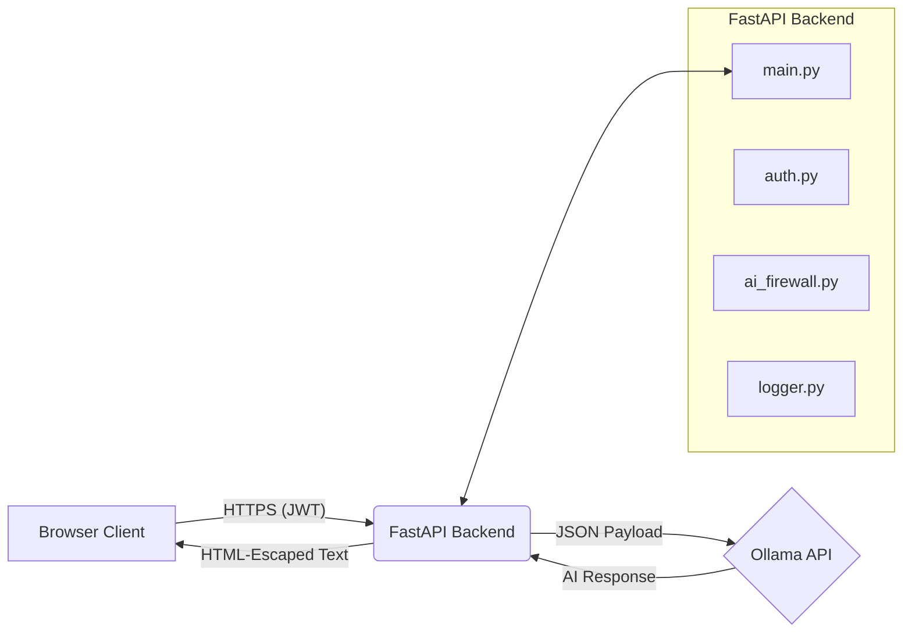
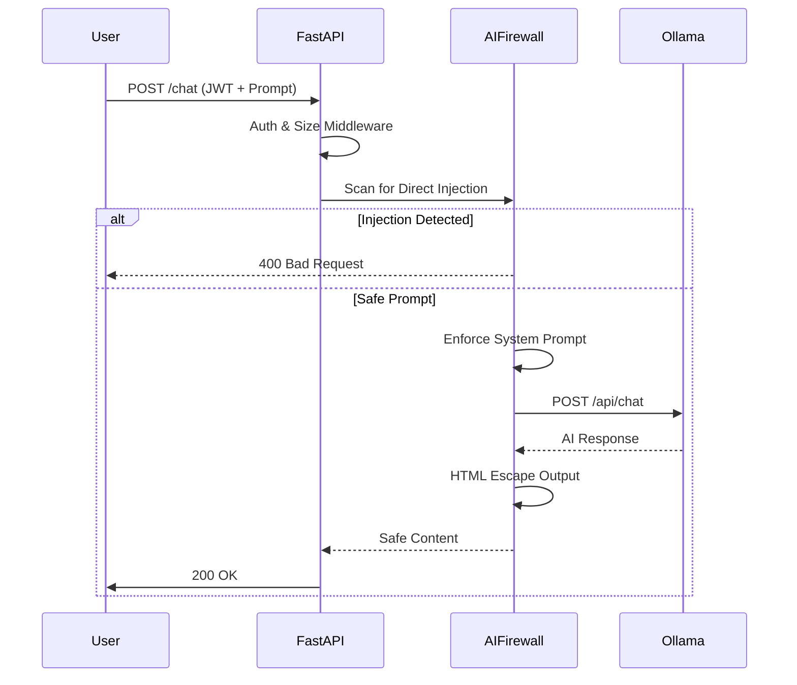

# Architecture — Orion AI Assistant (SEC_AI_Chatbot)

## Project Overview
The Orion AI Assistant is a fully hardened, local AI chatbot built for internal enterprise usage. It provides a secure interface for employees to interact with a Large Language Model (LLM) and analyze uploaded documents. The system is designed with a "security-first" mindset, integrating multiple layers of defense to protect against prompt injection, malicious file uploads, denial of service, and data leakage.

## Objectives
- **Secure AI Interaction:** Prevent prompt injection and jailbreaks.
- **Data Privacy:** Keep all inference local and prevent data exfiltration.
- **Safe Document Processing:** Allow users to upload files for AI context without risking path traversal or server compromise.
- **Auditability:** Maintain a robust, tamper-evident trail of all security events and user actions.

## Technology Stack
- **Backend Framework:** FastAPI
- **AI Inference Engine:** Ollama (running Llama 3.2 locally)
- **Authentication:** PyJWT (JSON Web Tokens)
- **Rate Limiting:** SlowAPI
- **File Validation:** `python-magic-bin`
- **Dependency Management:** `pip-tools` (fully pinned lockfile)

---

## High-Level Architecture



---

## Request Flow (Frontend → FastAPI → Ollama → Response)

1. **Client Request:** The user sends a chat payload to the `/chat` endpoint.
2. **Middleware & Auth:** 
   - `ContentSizeLimitMiddleware` verifies the HTTP body isn't oversized.
   - `SecurityHeadersMiddleware` applies CSP, HSTS, and X-Frame-Options.
   - `verify_token` validates the Bearer JWT.
3. **Pydantic Validation:** The request body is strictly typed and parsed.
4. **AI Firewall (Pre-computation):**
   - Scans user prompts for direct injection signatures (Regex).
   - Enforces the server-side System Prompt (stripping client system roles).
5. **Inference:** The sanitized payload is dispatched to the local Ollama API.
6. **AI Firewall (Post-computation):**
   - Output length is verified.
   - Output sanitization is applied (HTML-escaping to prevent XSS).
7. **Audit & Response:** The event is logged via structured audit logging, and the safe response is returned to the client.



---

## File Upload Flow

1. **Upload Request:** The user sends a multipart form to `/upload` containing a document.
2. **Validation:**
   - **Size Limit:** Aborts if `file.size > MAX_UPLOAD_SIZE_BYTES`.
   - **Extension Whitelist:** Rejects unknown extensions (e.g., `.exe`).
   - **MIME Sniffing:** Uses `python-magic` to inspect file headers and ensure the true MIME type matches the extension.
3. **Storage:** The file is renamed to a secure UUID (preventing path traversal) and written to the `uploads/` directory.
4. **Extraction:** PyMuPDF / python-docx extracts the text.
5. **Context Isolation:** Text is wrapped in AI instruction delimiters (`--- BEGIN DOCUMENT ---`) to mitigate indirect prompt injection.

---

## Current Folder Structure

```text
SEC_AI_Chatbot/
├── docs/                   # Documentation and architectural diagrams
├── logs/                   # Structured, rotating application logs
├── uploads/                # UUID-named user uploaded documents
├── requirements.in         # Top-level dependencies
├── requirements.txt        # Pinned lockfile (via pip-compile)
├── config.py               # Environment variables & constants
├── logger.py               # Custom structured audit and security logger
├── auth.py                 # JWT token generation and validation
├── ai_firewall.py          # Injection detection and prompt enforcement
├── main.py                 # FastAPI endpoints and middleware routing
└── secure_system_prompt.txt# Centralized system instructions for the LLM
```

---

## Component Responsibilities

- **`main.py`**: The entry point. Handles all routing (`/token`, `/chat`, `/upload`), registers middlewares, configures CORS, and handles top-level exception wrapping.
- **`ai_firewall.py`**: The core security module for AI interactions. Responsible for regex-based injection detection, system prompt enforcement, document context isolation, and output sanitization.
- **`auth.py`**: Manages the lifecycle of JSON Web Tokens. Validates the signature, ensures tokens haven't expired, and guards protected endpoints.
- **`logger.py`**: A centralized structured logger that outputs JSON logs. It distinguishes between standard debug info, `security_event()` (attacks, failures), and `audit_log()` (successful actions).
- **`config.py`**: Centralizes the loading of `.env` files and defines all hard limits (e.g., `MAX_PROMPT_CHARS`, rate limits).

---

## Trust Boundaries

- **Untrusted (Red Zone):** All incoming HTTP requests, headers, JWT tokens (until validated), user chat inputs, and uploaded file contents.
- **Trusted (Green Zone):** The `.env` configuration file, the local file system (including `secure_system_prompt.txt`), the `logs/` directory, and the Ollama local inference service.

---

## Design Decisions

1. **Local Inference (Ollama):** Chosen over cloud APIs (OpenAI/Anthropic) to guarantee zero data exfiltration of internal enterprise documents.
2. **UUID File Storage:** Original filenames are discarded immediately upon upload to eliminate path traversal (`../`) and arbitrary file overwrite attacks.
3. **Regex-based Firewall:** We opted for a lightweight, regex-based heuristic firewall instead of an LLM-based classifier. This prioritizes latency and resource consumption over perfect zero-day attack detection.
4. **Pinned Dependencies:** `pip-tools` is used instead of standard `pip freeze` to separate top-level intent (`requirements.in`) from the rigid lockfile (`requirements.txt`), defending against supply chain poisoning.

---

## Current Limitations

- **Novel Jailbreaks:** The regex-based AI firewall protects against known direct injection patterns but is susceptible to novel, highly obfuscated zero-day jailbreaks.
- **Stateless Conversations:** The API currently has no database or session memory. Context is strictly limited to the current request payload.
- **No Role-Based Access Control (RBAC):** All authenticated users share the same permission level; there is no separation between standard users and administrators.
- **Manual Log Monitoring:** Logs are written to `logs/app.log` but are not yet shipped to a centralized SIEM (e.g., Datadog, Splunk) for active alerting.

---

## Planned Repository Documentation Structure

As this project scales, the documentation will be organized into the following numbered structure to facilitate easy onboarding and security auditing:

```text
docs/
├── 01_Architecture.md           # You are here
├── 02_Threat_Model.md           # STRIDE analysis and residual risks
├── 03_Security_Assessment.md    # Outcomes of vulnerability testing
├── 04_Hardening_Guide.md        # Deployment security checklist
├── 05_Testing.md                # Guide for running the pytest suite
├── 06_Attack_Demonstrations.md  # Payloads used to test the AI firewall
├── 07_Model_Card.md             # LLM metadata, limitations, and modalities
└── 08_Final_Security_Report.md  # Executive summary of project security

reports/
├── pip-audit.txt                # Output of vulnerability scans
├── semgrep-*.txt                # SAST rule violations
└── dependency-audit.md          # Lockfile security status
```
