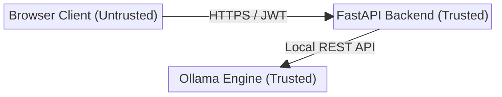
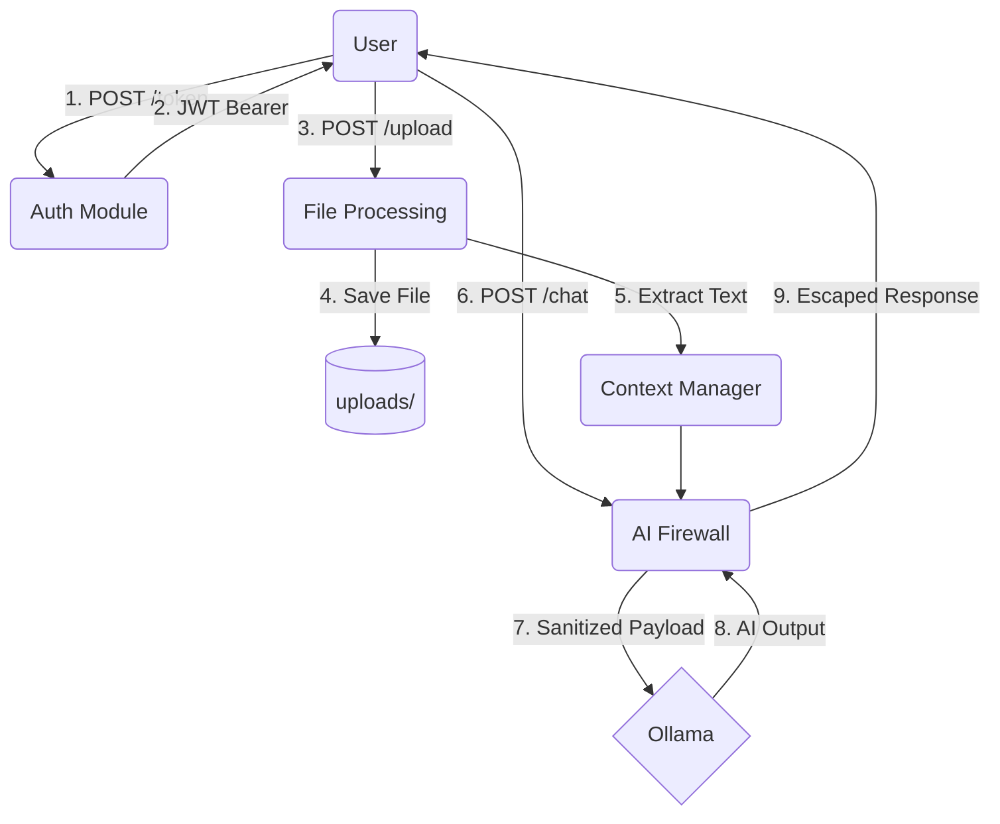

# Threat Model — Orion AI Assistant

## Executive Summary
This document outlines the threat model for the Orion AI Assistant (`SEC_AI_Chatbot`), a local enterprise AI chat application built on FastAPI and Ollama. By analyzing the system's architecture, data flows, and trust boundaries, we identify the primary attack surfaces and potential threat actors. This model prioritizes risks based on the OWASP Top 10 for Web and LLM Applications to inform the subsequent security hardening phases.

## System Overview
The Orion AI Assistant allows internal employees to authenticate, upload documents (e.g., PDF, DOCX, TXT), and interact with a local Llama 3.2 model via a chat interface. The system comprises a frontend browser client, a FastAPI backend, and a locally hosted Ollama inference engine.

## Assets to Protect
1. **Confidential Documents:** Sensitive enterprise files uploaded by users.
2. **System Prompt & Configuration:** The core instructions that govern the LLM's behavior and constraints.
3. **Authentication Secrets:** JWT Secret Keys and application passwords (`APP_PASSWORD`).
4. **Audit Logs:** The historical record of user actions and security events.
5. **Backend Server Resources:** CPU, memory, and disk space (critical for availability).

## Trust Boundaries
A trust boundary exists anywhere data changes its level of trust or moves between distinct components.

1. **Client to FastAPI (Untrusted → Trusted):** All incoming HTTP requests, headers, tokens, file uploads, and chat payloads are completely untrusted.
2. **FastAPI to Ollama (Trusted → Trusted):** The communication loop between the backend and the local AI model. While the connection is trusted, the AI model's output cannot be implicitly trusted due to hallucination or injection side-effects.

## Data Flow

## Entry Points
1. `/token` (POST): Authentication endpoint.
2. `/chat` (POST): Core AI interaction endpoint.
3. `/upload` (POST): Document ingestion endpoint.

## Attack Surface
- **HTTP Payload Parsing:** Pydantic models handling JSON bodies.
- **File Upload Parsing:** MIME type detection, extension handling, and parsing libraries (`PyMuPDF`, `python-docx`).
- **Prompt Construction:** The concatenation of user input, extracted document context, and the system prompt.
- **Output Rendering:** Sending LLM-generated text back to the client.

## Threat Actors
1. **Malicious Insider (Employee):** An authenticated user attempting to bypass AI constraints, access unauthorized files, or exfiltrate data.
2. **External Attacker:** An unauthenticated user attempting to brute-force credentials or cause Denial of Service (DoS).
3. **Third-Party File Sender:** An external entity who sends a malicious document to an employee, who then uploads it to the chatbot (Indirect Injection).

## Security Assumptions
- The underlying operating system and file system permissions are correctly configured.
- The Ollama engine is bound to `localhost` and not exposed to the public internet.
- The environment variables (secrets) are securely injected at runtime.

---

## Potential Attack Scenarios

1. **Direct Prompt Injection / Jailbreaking:** A user sends a crafted chat message (e.g., "Ignore all previous instructions") to override the system prompt and force the AI to leak internal flags or generate inappropriate content.
2. **Indirect Prompt Injection:** A user uploads a seemingly benign PDF (e.g., a vendor resume) that contains hidden text instructing the LLM to execute a malicious payload when parsed.
3. **Path Traversal via File Upload:** An attacker intercepts the upload request and changes the filename to `../../../windows/system32/cmd.exe` in an attempt to overwrite system files.
4. **Denial of Service (DoS):** An attacker floods the `/chat` endpoint with massive payloads (100,000+ characters) or rapidly uploads 5GB files to exhaust RAM and disk space.
5. **Cross-Site Scripting (XSS):** The LLM is tricked into generating malicious JavaScript (``), which the backend returns and the frontend executes.

---

## Risks Prior to Security Hardening & Threat Prioritization

The following matrix represents the unmitigated risks *before* the application's security controls were applied.

| Risk Scenario | OWASP Top 10 (Web) | OWASP Top 10 (LLM) | Priority |
|---|---|---|---|
| Direct Prompt Injection | A03: Injection | LLM01: Prompt Injection | **HIGH** |
| Indirect Prompt Injection | A03: Injection | LLM01: Prompt Injection | **HIGH** |
| Unauthorized Access (Brute Force) | A07: Identification/Auth Failures | - | **HIGH** |
| Path Traversal / Arbitrary File Overwrite | A01: Broken Access Control | - | **HIGH** |
| XSS via AI Output | A03: Injection | LLM02: Insecure Output Handling | **HIGH** |
| DoS via Token Exhaustion / File Size | A05: Security Misconfiguration | LLM04: Model Denial of Service | **MEDIUM** |
| System Prompt Data Leakage | A04: Insecure Design | LLM06: Sensitive Information Disclosure | **MEDIUM** |
| Insecure CORS / Missing Headers | A05: Security Misconfiguration | - | **LOW** |

---

## Planned Security Documentation

As the security posture of the Orion AI Assistant matures, the documentation will be structured to cover the entire lifecycle of assessment, remediation, and verification. Future documents in this repository will cover:

- **Security Assessment:** Detailed findings from static and dynamic analysis.
- **Hardening Guide:** Step-by-step instructions for deploying the mitigations.
- **Security Testing:** Pytest frameworks and CI integration instructions.
- **Attack Demonstrations:** Examples of payloads used to validate the AI firewall.
- **Model Card:** LLM metadata, capabilities, and inherent limitations.
- **Final Security Report:** An executive summary of the project's final security posture.
